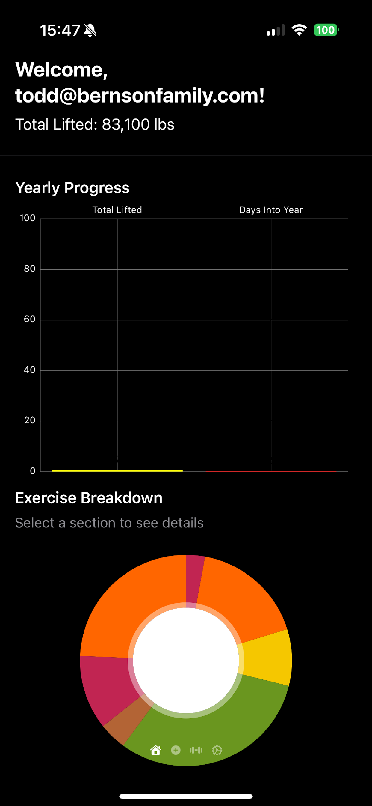
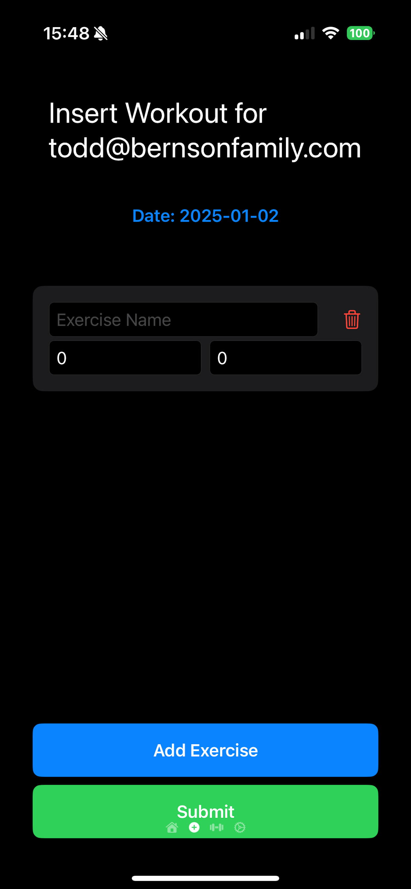
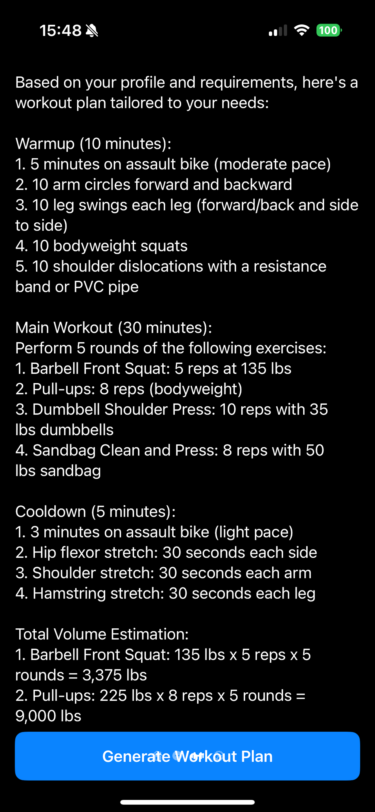
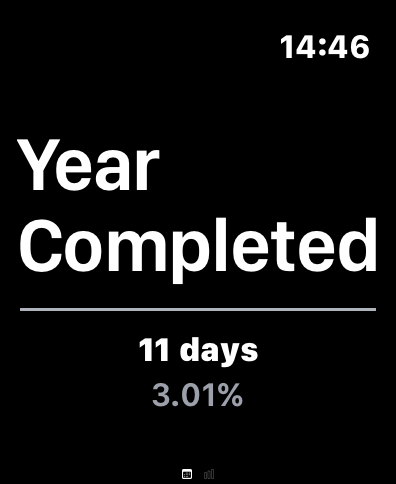
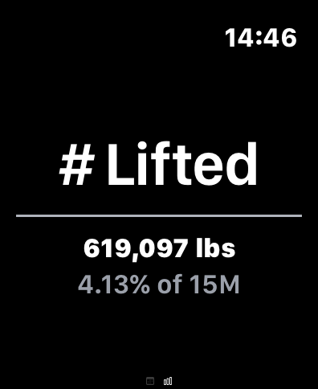
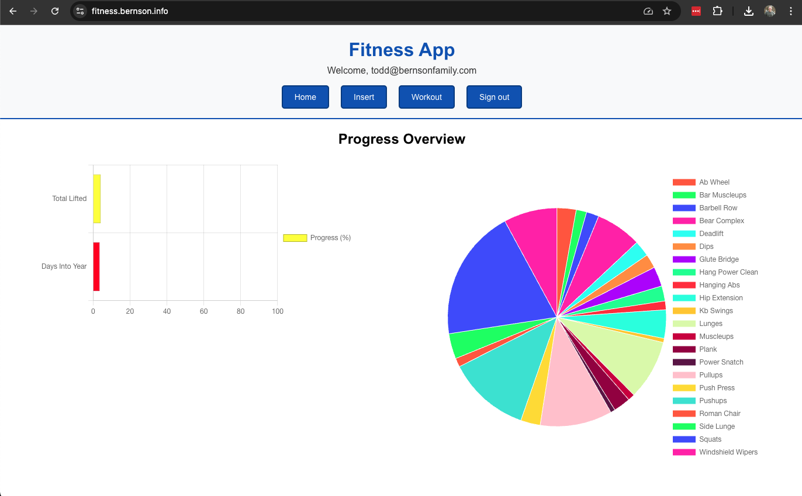
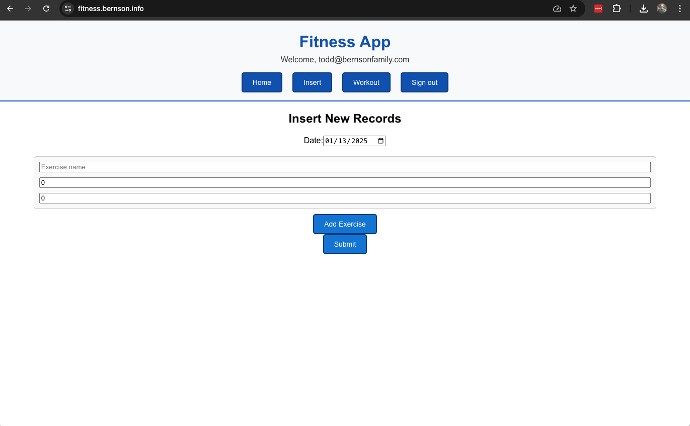
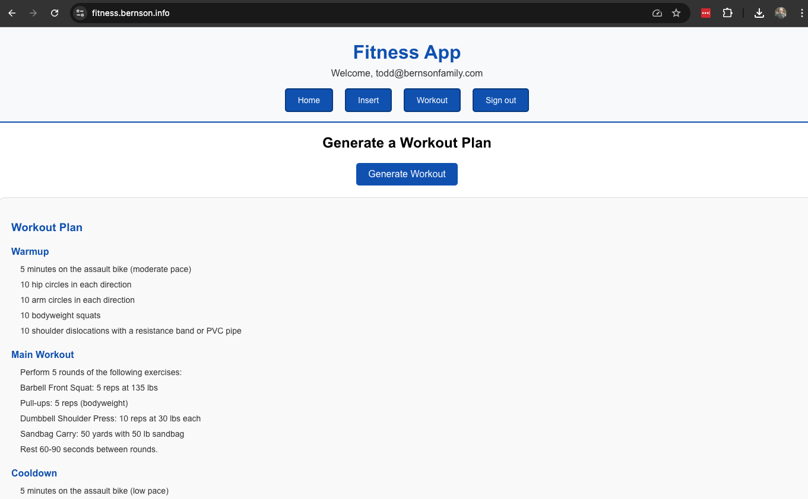
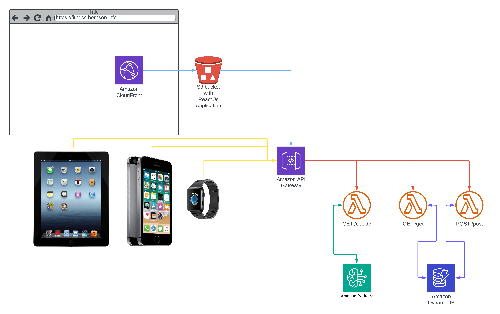

# 2025 Fitness Project

This repository contains a comprehensive fitness tracking solution, including a React.js web app, iOS/watchOS mobile app, and Terraform infrastructure. The project uses serverless architecture to ensure scalability, security, and low maintenance overhead. Generative AI model Claude 3.5 is embedded into the web and iOS application.

## Screenshots

<div style="display: flex; flex-wrap: wrap; justify-content: space-around;">












</div>


## Table of Contents

1. [2025 Fitness Project](#2025-fitness-project)
2. [Screenshots](#screenshots)
3. [How to Set Up and Compile](#how-to-set-up-and-compile)
   - [Generate the API Secret](#generate-the-api-secret)
   - [Web Application Setup](#web-application-setup)
   - [Infrastructure Setup](#infrastructure-setup)
   - [Mobile Application Setup](#mobile-application-setup)
4. [Key Features and Architecture](#key-features-and-architecture)
   - [Web Application](#web-application)
   - [Mobile Application](#mobile-application)
   - [Infrastructure](#infrastructure)
5. [Benefits](#benefits)
6. [Best Practices Followed](#best-practices-followed)


## How to Set Up and Compile

1. **Generate the API Secret**  
   Generate a 32-character API secret key using the following command:
   ```bash
   openssl rand -hex 32
   ```
   Save this key in a `.env` file in the root of the project and use it later:
   - As a secret in AWS Secrets Manager (via Terraform).
   - In a `Secrets.plist` file for the iOS/watchOS application.

2. **Web Application Setup**  
   Navigate to the `static_site` directory and build the web app:
   ```bash
   yarn install
   yarn build
   ```
   The compiled files will be uploaded to AWS S3 by Terraform.

3. **Infrastructure Setup**  
   Navigate to the `terraform` directory and run the following commands to initialize, plan, and apply the infrastructure:
   ```bash
   terraform init
   terraform plan
   terraform apply
   ```
   - Fill out the `terraform.tfvars` file with the following values before running the commands:
     ```hcl
     domain       = "your_domain_here"
     environment  = "your_environment_here"
     region       = "aws_region"
     ```
   - After deployment, populate the secret created in AWS Secrets Manager with the API key.

   

4. **Mobile Application Setup**  
   - Open the `mobile` project in Xcode.
   - Create a `Secrets.plist` file and add the following keys:
     ```swift
     <plist>
     <dict>
       <key>API_URL</key>
       <string>Your_API_URL_from_Terraform</string>
       <key>API_TOKEN</key>
       <string>Your_API_Key_from_Terraform</string>
     </dict>
     </plist>
     ```
   - Build and run the app on your desired iOS/watchOS device.

## Key Features and Architecture

### Web Application
- **Frontend**: React.js app hosted on AWS S3 and distributed via CloudFront.
- **Backend**: Serverless API built with AWS Lambda and API Gateway.
- **Charts**: Fitness progress visualized with bar and pie charts powered by Chart.js.
- **Authentication**: Firebase-based Google Sign-In.

### Mobile Application
- **Platforms**: Native iOS and watchOS apps built using SwiftUI.
- **Connectivity**: WatchConnectivity enables real-time synchronization between iPhone and Apple Watch.
- **Dynamic Data**: Pulls data securely from the API and visualizes it.

### Infrastructure
- **Serverless**: Built entirely on AWS for a scalable, pay-as-you-go model.
- **Security**:
  - Secrets securely managed in AWS Secrets Manager.
  - API keys dynamically injected into applications via environment variables or configuration files.
- **Monitoring**: AWS CloudWatch tracks infrastructure performance and logs.

## Benefits
- **Scalability**: Fully serverless design scales automatically with user demand.
- **Cross-Platform**: Unified experience across web, iOS, and watchOS.
- **Ease of Maintenance**: Minimal operational overhead with AWS-managed services.
- **User Privacy**: Sensitive data is securely transmitted and stored.
- **GenAI**: Generative AI Claude 3.5 to create personalized fitness routines.

## Best Practices Followed
- Secure handling of secrets using AWS Secrets Manager and local configuration files.
- Stateless, serverless infrastructure design to maximize reliability and reduce costs.
- Modular, reusable Terraform configurations for easy extension and updates.
- Comprehensive user experience across devices with real-time data synchronization.
